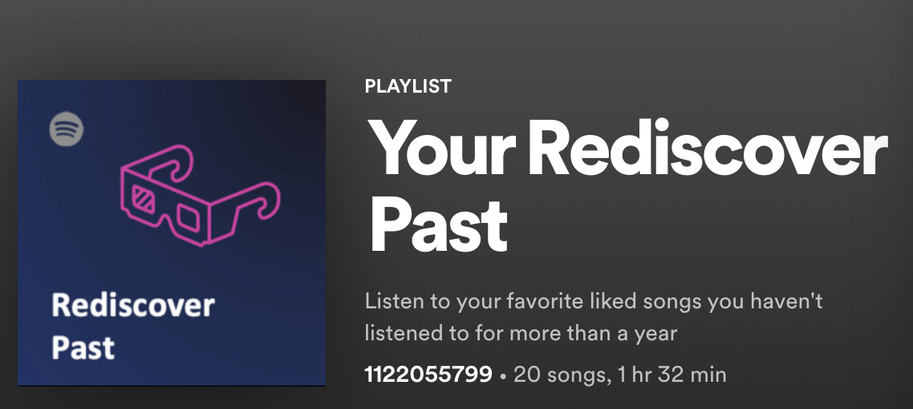

# liked2play

Use your personal Spotify data to create your own playlists for long-term liked songs rediscovery - rediscover the past.



## Description

This package uses your personal Spotify data, i.e. your past year's streaming history and your liked songs playlist,
to generate a playlist of music you might like and rediscover again, but haven't listend to for more than a year.
Check out [this](https://medium.com/@marcel.kurovski/your-rediscover-past-proposing-a-new-personalized-playlist-for-spotify-5e8f3b6f04f8)
blogpost for a more detailed description and some guidance. Cheers!

## Installation

In order to set up the necessary environment:

1. review and uncomment what you need in `environment.yml` and create an environment `liked2play` with the help of [conda]:
   ```
   conda env create -f environment.yml
   ```
2. activate the new environment with:
   ```
   conda activate liked2play
   ```

> **_NOTE:_**  The conda environment will have liked2play installed in editable mode.
> Some changes, e.g. in `setup.cfg`, might require you to run `pip install -e .` again.


Optional and needed only once after `git clone`:

3. install several [pre-commit] git hooks with:
   ```bash
   pre-commit install
   # You might also want to run `pre-commit autoupdate`
   ```
   and checkout the configuration under `.pre-commit-config.yaml`.
   The `-n, --no-verify` flag of `git commit` can be used to deactivate pre-commit hooks temporarily.

4. install [nbstripout] git hooks to remove the output cells of committed notebooks with:
   ```bash
   nbstripout --install --attributes notebooks/.gitattributes
   ```
   This is useful to avoid large diffs due to plots in your notebooks.
   A simple `nbstripout --uninstall` will revert these changes.


## Usage

There are two steps that need to be performed before you can use this. The best thing to do is to read
[this]() blogpost that guides you through everything.

1. Request your personal usage data [here](https://www.spotify.com/us/account/privacy). From my own experience, this took a couple of days.
2. Download your personal data once available (you will be notified by email) and extract it to your machine.
3. Create your Spotify API credentials [here](https://developer.spotify.com/dashboard/login) by adding a new app. Also add yourself as user to the app. Save
   - `client_id`
   - `client_secret`
   - `user_id`

   to your machine.
4. Adapt the config template `config.json` according to your own paths and preferences.

With the package installed the command `liked2play` becomes available on your system.
There are two required arguments:
1. `-c` stands for _config_ and expects the filepath of your `config.json`
2. `-m` stands for _mode_ and expects one of the steps you want to perform:
   - `analyze`: analyzes your liked songs and streaming history and generates a small summary statistics
   - `preprocess`: fetches music features and joins information with streaming information and liked songs required for determining your music taste profile
   - `generate`: uses your music taste profile to determine the _top-k_ songs to resemble your "Rediscover Past" playlist
   - `upload`: upload the generated playlist to your Spotify account
   - `end2end`: performs `preprocess`, `generate`, and `upload` in a single pass

During some runs you will be redirected to a website that starts with the URL you specified in the `config.json`.
Copy the full URL and enter it in your shell when asked for. This is for authentification.

Example Usage:
```
liked2play -c configs/config.json -m analyze -v
```

## Dependency Management & Reproducibility

1. Always keep your abstract (unpinned) dependencies updated in `environment.yml` and eventually
   in `setup.cfg` if you want to ship and install your package via `pip` later on.
2. Create concrete dependencies as `environment.lock.yml` for the exact reproduction of your
   environment with:
   ```bash
   conda env export -n liked2play -f environment.lock.yml
   ```
   For multi-OS development, consider using `--no-builds` during the export.
3. Update your current environment with respect to a new `environment.lock.yml` using:
   ```bash
   conda env update -f environment.lock.yml --prune
   ```
## Project Organization

```
├── LICENSE.txt             <- License as chosen on the command-line.
├── README.md               <- The top-level README for developers.
├── data
│   ├── external            <- Data from third party sources.
│   ├── interim             <- Intermediate data that has been transformed.
│   ├── processed           <- The final, canonical data sets for modeling.
│   └── raw                 <- The original, immutable data dump.
├── environment.yml         <- The conda environment file for reproducibility.
├── notebooks               <- Jupyter notebooks. Naming convention is a number (for
│                              ordering), the creator's initials and a description,
│                              e.g. `1.0-fw-initial-data-exploration`.
├── pyproject.toml          <- Build system configuration. Do not change!
├── setup.cfg               <- Declarative configuration of your project.
├── setup.py                <- Use `pip install -e .` to install for development or
|                              or create a distribution with `tox -e build`.
├── src
│   └── liked2play          <- Actual Python package where the main functionality goes.
├── tests                   <- Unit tests which can be run with `py.test`.
├── .coveragerc             <- Configuration for coverage reports of unit tests.
├── .isort.cfg              <- Configuration for git hook that sorts imports.
└── .pre-commit-config.yaml <- Configuration of pre-commit git hooks.
```

<!-- pyscaffold-notes -->

## Note

This project has been set up using [PyScaffold] 4.1.1 and the [dsproject extension] 0.6.1.

[conda]: https://docs.conda.io/
[pre-commit]: https://pre-commit.com/
[Jupyter]: https://jupyter.org/
[nbstripout]: https://github.com/kynan/nbstripout
[Google style]: http://google.github.io/styleguide/pyguide.html#38-comments-and-docstrings
[PyScaffold]: https://pyscaffold.org/
[dsproject extension]: https://github.com/pyscaffold/pyscaffoldext-dsproject
